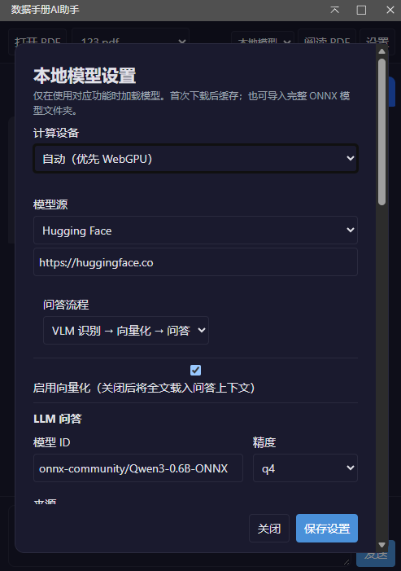
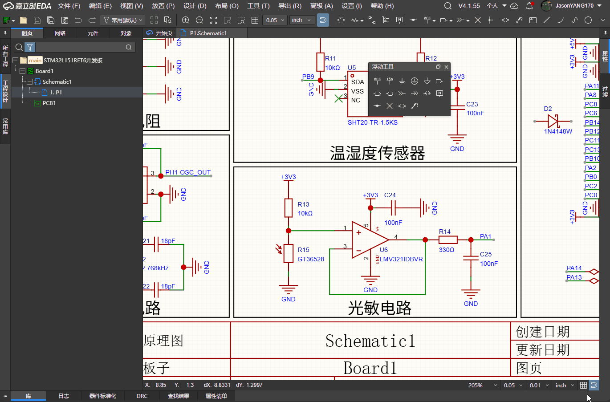
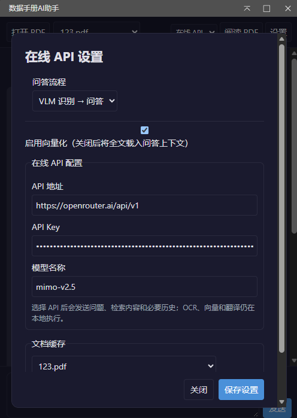
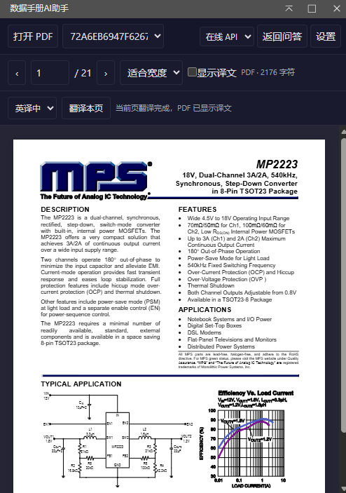
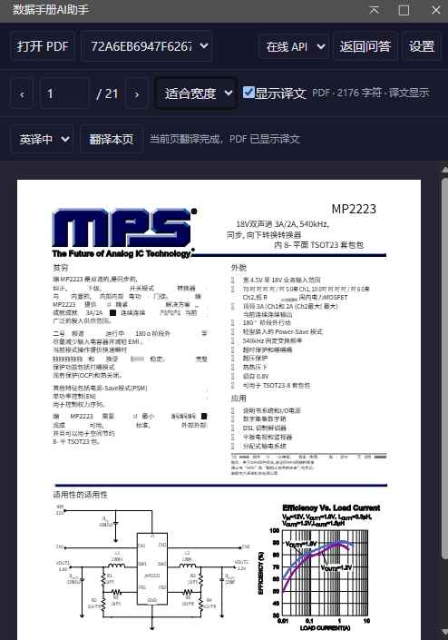

# 数据手册AI问答助手

**V1.9.1起插件完成重构，支持本地AI模式，并引入VLM视觉模型、Embedding向量模型、LLM大语言模型，使用本地模式需要确保设备有较好性能**

基于 VLM 文档视觉模型 的数据手册AI问答助手。
导入 PDF 数据手册，提问时自动检索相关内容，通过 AI 模型生成回答。

- 默认通用模型：[Qwen3-0.6B](https://huggingface.co/Qwen/Qwen3-0.6B)
- 默认VLM 文档视觉模型：[granite-docling-258M](https://huggingface.co/ibm-granite/granite-docling-258M)
- 默认向量模型：[multilingual-e5-small](https://huggingface.co/intfloat/multilingual-e5-small)
- 默认中英互译模型：[Helsinki-NLP opus-mt](https://huggingface.co/Helsinki-NLP)
- 默认模型镜像站：[🤗HuggingFace](https://huggingface.co/)

## 功能演示

### 本地AI模式 VLM+Embedding+LLM的WebGPU推理

| 推理效果 | 推理配置 |
| --- | --- |
|     |     |

### 在线AI模式 基于在线API问答

| 推理效果 | 推理配置 |
| --- | --- |
|     |     |

### PDF阅读器 本地翻译功能

| 原文 | 译文 |
| --- | --- |
|    |    |

## 快速开始

### 安装

1. 下载扩展包（`.eext` 文件）
2. 打开嘉立创EDA专业版
3. 进入 **高级 → 扩展管理器 → 上传/安装扩展**
4. 选择下载的 `.eext` 文件完成安装

## 权限要求

| 权限 | 用途 |
|------|------|
| 外部交互权限 | 下载 PDF 数据手册、调用 AI API |

如遇 PDF 下载失败，请在扩展管理器中确认已启用本扩展的**外部交互权限**。

## 致谢

- [Transformers.js](https://github.com/huggingface/transformers.js) — 浏览器端模型推理
- [pdf.js](https://github.com/mozilla/pdf.js) — PDF 文档解析
- [Qwen3-0.6B](https://huggingface.co/Qwen/Qwen3-0.6B) — LLM 大语言模型
- [granite-docling-258M](https://huggingface.co/ibm-granite/granite-docling-258M) — VLM 文档视觉模型
- [multilingual-e5-small](https://huggingface.co/intfloat/multilingual-e5-small) — Embedding 多语言嵌入模型
- [Helsinki-NLP opus-mt](https://huggingface.co/Helsinki-NLP) — PDF 阅读器本地翻译模型
- [🤗Hugging Face](https://huggingface.co/) — AI开源社区
- [Open Neural Network Exchange](https://github.com/onnx) — ONNX社区
