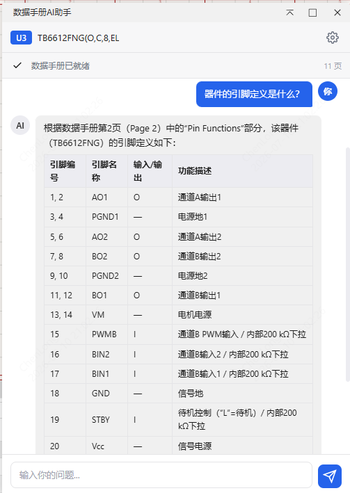
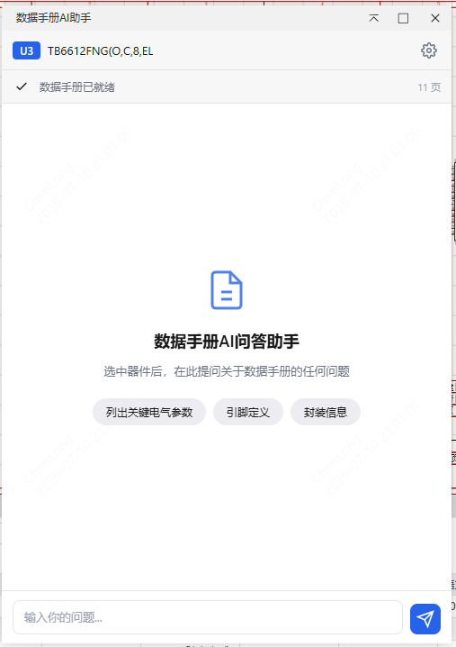

[简体中文](./README.md) | [English](./README.en.md) | [繁體中文](./README.zh-Hant.md) | [日本語](./README.ja.md) | [Русский](#)

# Дatasheet AI Ассистент

Расширение для JLCEDA Pro Edition — выберите компонент на схеме, автоматически получите даташет и задавайте технические вопросы через AI-диалог.


## Демонстрация

**Выберите компонент и откройте AI-чат через меню**



**Окно AI-чата — автозагрузка даташета, стриминговый Q&A**



## Возможности

- **Запуск в один клик**: выберите компонент на схеме и быстро откройте окно AI-чата через меню
- **Автоматическое получение даташета**: автоматически считывает URL даташета компонента и загружает PDF
- **Умный разбор PDF**:
  - Текстовые PDF: прямое извлечение текста (pdf.js)
  - Отсканированные PDF: автоматическое переключение на OCR (Tesseract.js)
- **Поиск по требованию**: интеллектуальное сопоставление релевантных абзацев по ключевым словам вопроса; автоматическое расширение разбора при отсутствии совпадений
- **AI-диалог со стримингом**: на базе OpenAI-совместимого API с потоковым выводом в реальном времени (SSE)
- **Управление контекстом**: автоматическое сохранение истории диалога (до 6 последних сообщений)
- **Рендеринг Markdown**: поддержка блоков кода, таблиц, списков и других форматов
- **Адаптивная тема**: следует системной светло/тёмной цветовой схеме
- **Настраиваемая конфигурация API**: поддержка настройки эндпоинта, ключа и названия модели

## Быстрый старт

### Установка

1. Скачайте пакет расширения (файл `.eext`)
2. Откройте JLCEDA Pro Edition
3. Перейдите в **Дополнительно → Менеджер расширений → Загрузить/Установить расширение**
4. Выберите скачанный файл `.eext` для установки

### Использование

1. Выберите компонент на схеме
2. Нажмите в верхнем меню **Datasheet AI Ассистент → Открыть AI-чат**
3. При первом использовании нажмите на значок ⚙ в правом верхнем углу для настройки API:
   - **API эндпоинт**: например, `https://api.openai.com/v1`
   - **API Key**: ваш ключ AI-сервиса
   - **Название модели**: например, `gpt-4o-mini`
4. После загрузки даташета введите свой вопрос в поле ввода

> [!TIP]
> Примеры вопросов: перечислить ключевые электрические параметры, какие выводы у компонента, информация о корпусе, диапазон рабочих напряжений и т.д.

## Требуемые разрешения

| Разрешение | Назначение |
|------------|------------|
| Внешнее взаимодействие | Загрузка PDF-даташетов, вызов AI API |

Если загрузка PDF не удалась, убедитесь, что **разрешение на внешнее взаимодействие** включено для данного расширения в Менеджере расширений.

## Технологии

- [pdf.js](https://github.com/mozilla/pdf.js) — разбор PDF-документов
- [Tesseract.js](https://github.com/naptha/tesseract.js) — OCR-распознавание текста
- OpenAI-совместимый API — AI-диалог (SSE-стриминг)

## Структура проекта

```
datasheet-ai-assistant/
├── src/
│   └── index.ts            # Главная точка входа расширения
├── iframe/
│   ├── chat.html           # Окно AI-чата (HTML + встроенные CSS/JS)
│   ├── chat.js             # JS-логика окна чата (исходный код)
│   └── chat.css            # Стили окна чата (исходный код)
├── images/
│   └── logo.png            # Иконка расширения
├── extension.json          # Конфигурация расширения
├── package.json            # Зависимости и скрипты сборки
└── build/
    └── dist/               # Скомпилированный .eext вывод
```

## Сборка из исходного кода

```shell
# Установка зависимостей
npm install

# Компиляция и упаковка
npm run build
```

Готовый пакет расширения будет в `./build/dist/`.

## Документация для разработчиков

Документация по API расширений JLCEDA Pro Edition: [https://prodocs.easyeda.com/en/api/guide/](https://prodocs.easyeda.com/en/api/guide/)

## История обновлений

### v1.0.0

- Начальный выпуск
- Автоматическое получение даташета для выбранного компонента
- Поддержка извлечения текста из PDF и OCR для отсканированных документов
- Стриминговый чат через OpenAI-совместимый API
- Стратегия поиска по требованию с интеллектуальным сопоставлением контента

## Лицензия

[Apache License 2.0](./LICENSE)
